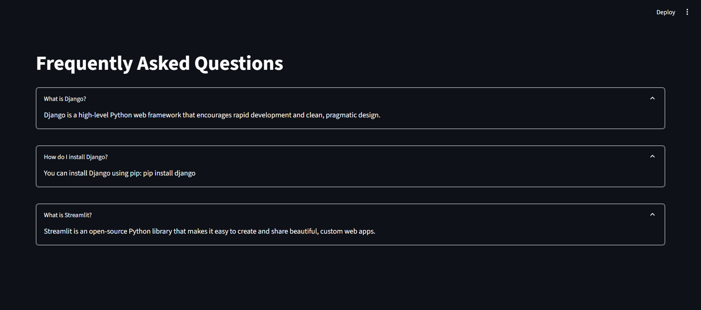

# Simple FAQ System

A lightweight Django backend with a Streamlit frontend for displaying frequently asked questions.

## Features

- **Simple REST API** built with Django
- **Lightweight Frontend** using Streamlit
- **No Database Required** - All FAQs are hardcoded
- **Easy to Customize** - Just edit the Python files to update FAQs

## Prerequisites

- Python 3.8+
- pip (Python package manager)

## Setup Instructions

### 1. Clone and Setup

```bash
git clone <repository-url>
cd MyDjangoProject

# Create and activate virtual environment (recommended)
python -m venv venv
.\\venv\\Scripts\\activate  # Windows
# source venv/bin/activate  # macOS/Linux

# Install requirements
pip install -r requirements.txt
```

### 2. Run the Application

1. Start the Django backend server (in one terminal):
   ```bash
   python manage.py runserver
   ```
   The API will be available at `http://localhost:8000/api/simple/simple-faqs/`

2. In another terminal, start the Streamlit frontend:
   ```bash
   streamlit run streamlit_app/app.py --server.port=8502
   ```
   The app will be available at `http://localhost:8502`

## Project Structure

```
MyDjangoProject/
├── faq/                    # FAQ Django app
│   ├── __init__.py
│   ├── views_simple.py    # Simple FAQ view with hardcoded data
│   └── urls_simple.py     # Simple URL configuration
├── faq_project/           # Project configuration
│   ├── __init__.py
│   ├── settings.py        # Django settings
│   └── urls.py           # Main URL configuration
├── streamlit_app/         # Streamlit frontend
│   └── app.py            # Streamlit application
├── manage.py             # Django management script
└── requirements.txt      # Project dependencies
```

## Customization

### Updating FAQs

To update the FAQs, edit the `FAQS` list in either:
1. `faq/views_simple.py` - For the Django API
2. `streamlit_app/app.py` - For the hardcoded fallback

## How It Works

1. The Django backend serves a simple JSON API with hardcoded FAQs
2. The Streamlit frontend fetches and displays these FAQs
3. If the API is unavailable, it falls back to the hardcoded FAQs

## API Endpoints

- `GET /api/categories/` - List all FAQ categories
- `GET /api/categories/<id>/` - Get a specific category
- `GET /api/categories/<id>/questions/` - Get questions for a category
- `GET /api/questions/` - List all questions
- `POST /api/translate/` - Translate text

## Testing

To run the test suite:

```bash
# Run all tests
pytest

# Run tests with coverage report
pytest --cov=faq
```

## Environment Variables

Create a `.env` file in the project root with the following variables:

```
GEMINI_API_KEY=your_gemini_api_key_here
DEBUG=True
SECRET_KEY=your_django_secret_key
```

## License

This project is licensed under the MIT License.

